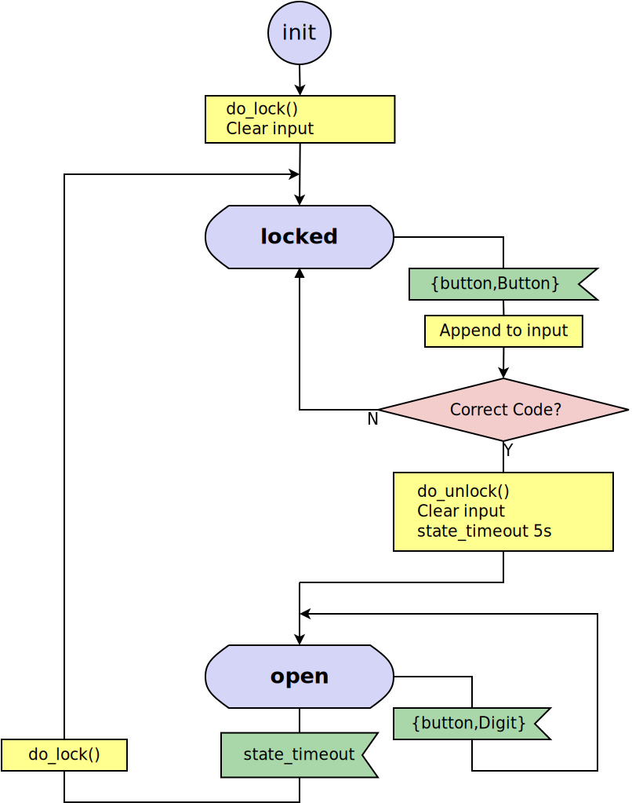
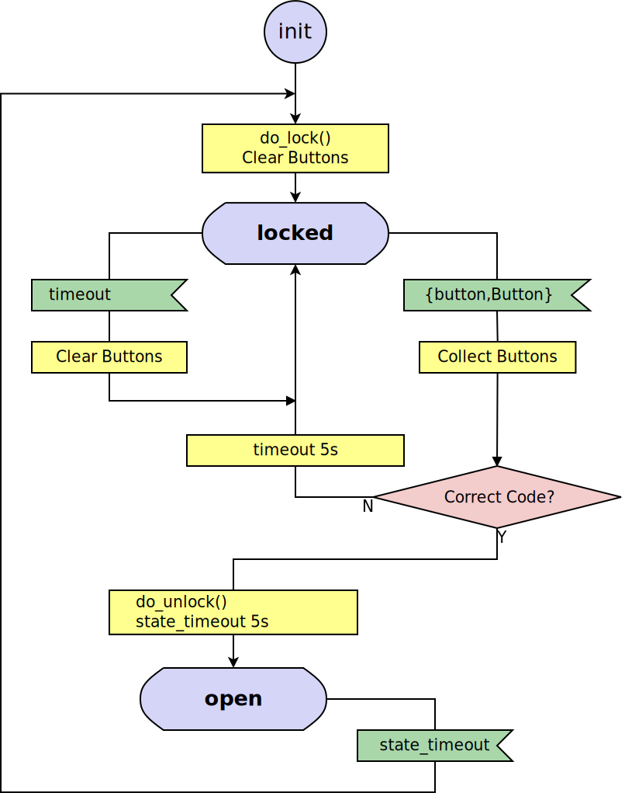

# Goal 1 : State transition

1. state : locked, open
2. init state : locked
3. init data : %{code :: [1, 2], input :: []}
4. event handler:
   1. locked 에서 이벤트 {:button, 3} -> {:button, 1} -> {:button, 2} 를 받으면 open으로 전이하고 input clear.
   2. open 상태에서는 {:button, \_} 무시.

# Goal 2 : State timeout

1. locked -> open 으로 변할때 state_timeout 5000ms 걸고,
2. state_timeout 발생시 locked 로 transition.

# Goal 3 : Event timeout

1. locked 상태에서 {:button, \_} 이벤트 발생마다 timeout 5000ms 를 걸고,
2. timeout 발생시 input clear.

# Goal 4 : Moore machine

1. 현재 구현은 event handler 에서 side effect(=do_unlock)가 발생하는 Mealy machine임.
2. callback_mode 를 [:state_functions, :state_enter] 로 변경하고, state진입시 발생하는 enter event에서 side effect를 발생하도록 변경.

# Goal 5 : Test w/o side effect

1. 문제점 : mix test 시마다 do_lock, do_unlock이 실행되어 Locked, Unlocked 메시지가 출력된다.
2. 해결법 : definject 라이브러리를 사용.
